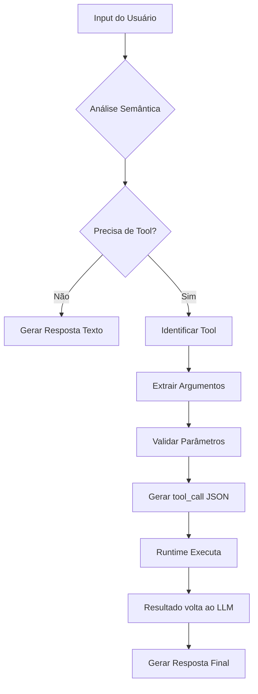

# Como o LLM Decide Quando/Como Chamar Tools

## 🧠 1. Treinamento com Function Calling

O modelo foi treinado com exemplos de **function calling**, aprendendo padrões como:

```python
# Durante o treinamento, o modelo viu milhões de exemplos assim:

# Exemplo 1: NÃO precisa de tool
Input: "Oi, bom dia!"
Output: {"content": "Olá! Bom dia! Como posso ajudar?"}

# Exemplo 2: PRECISA de tool
Input: "Qual o clima em São Paulo?"
Output: {
  "tool_calls": [{
    "function": {
      "name": "get_weather",
      "arguments": {"city": "São Paulo"}
    }
  }]
}
```

## 🔍 2. Análise Semântica em Tempo Real

Quando você envia uma mensagem, o modelo faz uma análise em múltiplas camadas:

### Passo 1: Identificação de Intenção
```python
"Oi"
→ Saudação
→ Não precisa de dados externos
→ Responder diretamente

"Consultar CPF 00835690490..."
→ Consulta de dados
→ Menção a CPF, data, cidade
→ Matches com descrição de unimed_consult
→ Precisa chamar tool
```

### Passo 2: Matching com Descrições das Tools

O modelo compara a intenção com as descrições das ferramentas disponíveis:

```json
{
  "name": "unimed_consult",
  "description": "Consulta dados de beneficiário e contratos na API Unimed"
}
```

Palavras-chave detectadas:
- "consultar" → match com "Consulta"
- "CPF" → match com "beneficiário"
- "contrato" → match com "contratos"

**Score de relevância: ALTO** → Usar esta tool

## 🎯 3. Extração de Argumentos

O modelo foi treinado para fazer **Named Entity Recognition (NER)** e **slot filling**:

```python
Input: "Preciso consultar o contrato do CPF 00835690490, nascido em 28/03/1979 em Natal"

# O modelo identifica entidades:
CPF_PATTERN = r'\d{11}'  # → 00835690490
DATE_PATTERN = r'\d{2}/\d{2}/\d{4}'  # → 28/03/1979
CITY_NAME = "Natal"  # → Reconhecimento de cidade

# Mapeia para os parâmetros da função:
{
  "cpf": "00835690490",          # Extraído via regex/pattern
  "data_nascimento": "1979-03-28", # Convertido para formato esperado
  "cidade": "Natal"               # Mapeado para "Natal_Tasy"
}
```

## 🔧 4. Representação Interna (Embeddings)

O modelo usa embeddings para entender similaridade semântica:

```python
# Embedding do input do usuário
user_embedding = embed("consultar contrato CPF...")

# Embeddings das ferramentas disponíveis
tool_embeddings = {
  "unimed_consult": embed("Consulta dados beneficiário contratos API Unimed"),
  "weather_tool": embed("Obter previsão tempo clima temperatura"),
  "calculator": embed("Calcular matemática números operações")
}

# Calcula similaridade cosseno
similarities = cosine_similarity(user_embedding, tool_embeddings)
# unimed_consult: 0.89 (ALTA!)
# weather_tool: 0.12
# calculator: 0.08
```

## 📊 5. Tokens Especiais no Modelo

Modelos com suporte nativo a tools têm tokens especiais no vocabulário:

```python
# Tokens especiais adicionados durante fine-tuning
SPECIAL_TOKENS = [
  "<tool_call>",
  "</tool_call>",
  "<function_name>",
  "</function_name>",
  "<arguments>",
  "</arguments>"
]

# O modelo gera internamente algo como:
"""
<tool_call>
  <function_name>unimed_consult</function_name>
  <arguments>{"cpf": "00835690490", ...}</arguments>
</tool_call>
"""
```

## 🧮 6. Probabilidades de Decisão

O modelo calcula probabilidades para cada ação possível:

```python
# Para input "Oi"
P(resposta_texto) = 0.95     # ✅ Alta probabilidade
P(tool_call) = 0.05          # ❌ Baixa probabilidade

# Para input "Consultar CPF..."
P(resposta_texto) = 0.10     # ❌ Baixa probabilidade
P(tool_call) = 0.90          # ✅ Alta probabilidade
  P(unimed_consult) = 0.88   # ✅ Específico para esta tool
  P(outras_tools) = 0.02     # ❌ Baixa para outras
```

## 🎓 7. Fine-tuning Específico

O modelo passou por fine-tuning com exemplos específicos:

```python
training_examples = [
  {
    "input": "Várias formas de pedir consulta Unimed",
    "output": "tool_call com argumentos corretos"
  },
  {
    "input": "Saudações e conversas gerais",
    "output": "Resposta direta sem tools"
  },
  # Milhares de variações...
]
```

## 🔄 8. Fluxo de Decisão Completo



## 💡 9. Exemplo Prático de Decisão

```python
def llm_decision_process(user_input, available_tools):
    # 1. Tokenização e embedding
    tokens = tokenize(user_input)
    embedding = encode(tokens)

    # 2. Classificação de intenção
    intent = classify_intent(embedding)

    # 3. Decisão sobre uso de tools
    if intent.requires_external_data:
        # 4. Seleção da tool apropriada
        best_tool = find_best_matching_tool(intent, available_tools)

        # 5. Extração de argumentos
        entities = extract_entities(user_input)
        arguments = map_entities_to_parameters(entities, best_tool.parameters)

        # 6. Geração do tool_call
        return {
            "tool_calls": [{
                "function": {
                    "name": best_tool.name,
                    "arguments": arguments
                }
            }]
        }
    else:
        # Gerar resposta direta
        return {
            "content": generate_text_response(user_input)
        }
```

## 🎯 10. Por que Funciona?

1. **Atenção Multi-Head**: O modelo "presta atenção" simultaneamente em:
   - Palavras-chave (CPF, contrato, consultar)
   - Estrutura da frase
   - Contexto geral
   - Descrições das ferramentas

2. **Transformers**: Permitem entender relações complexas entre tokens distantes

3. **Aprendizado por Reforço**: O modelo foi recompensado por:
   - Usar tools quando apropriado
   - Não usar quando desnecessário
   - Extrair argumentos corretamente

## 📝 Resumo

O LLM sabe quando/como chamar tools através de:

1. **Treinamento especializado** com milhões de exemplos
2. **Análise semântica** da intenção do usuário
3. **Matching** entre input e descrições das tools
4. **Extração inteligente** de entidades e argumentos
5. **Tokens especiais** para estruturar tool_calls
6. **Cálculo de probabilidades** para tomar decisões

É como se o modelo tivesse aprendido a pensar:
- "Isso parece uma saudação → respondo direto"
- "Isso parece consulta de dados → preciso da tool unimed_consult"
- "Vejo CPF, data e cidade → extraio e formato para a API"